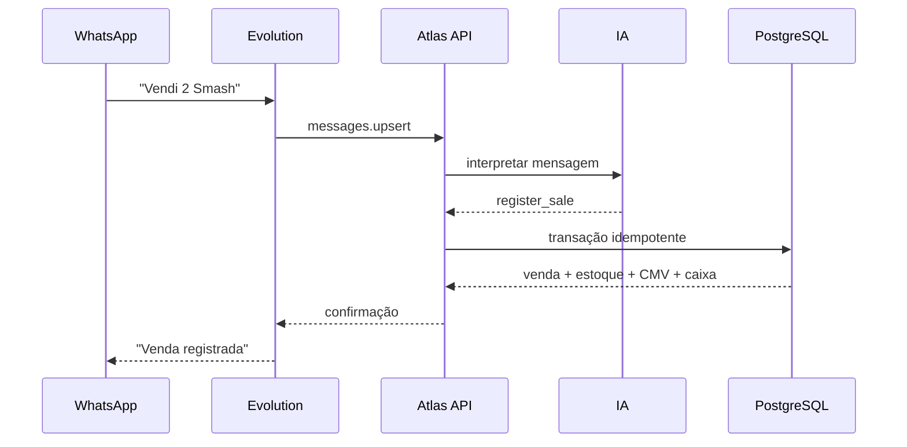

# Arquitetura do MVP

## Princípio central

A linguagem natural é uma interface, não uma regra de negócio.

O modelo escolhe um comando e devolve argumentos estruturados. O backend valida
esses argumentos, resolve os cadastros e executa SQL transacional. Dessa forma,
estoque, CMV e caixa continuam consistentes mesmo que a mensagem seja informal.

## Componentes

| Componente          | Responsabilidade                                                                |
| ------------------- | ------------------------------------------------------------------------------- |
| `apps/whatsapp`     | Validar webhook, extrair texto, mapear instância para empresa e enviar resposta |
| `apps/api`          | Expor contratos HTTP, coordenar interpretação e execução                        |
| `packages/ai`       | Transformar linguagem natural em comando estruturado                            |
| `packages/core`     | Regras puras, normalização, custos e respostas                                  |
| `packages/database` | Idempotência, transações, estoque, financeiro e indicadores                     |
| `apps/dashboard`    | Consultar e apresentar o estado atual                                           |

## Sequência de uma venda

## Garantias atuais

- chave única `(provider, provider_event_id)` contra webhooks repetidos;
- bloqueio pessimista de insumos durante venda e compra;
- rollback integral quando falta estoque, ficha técnica ou cadastro;
- custo médio ponderado atualizado nas compras;
- CMV congelado no momento da venda;
- separação por `business_id` desde a primeira migração;
- chave OpenAI e Evolution apenas em variáveis de ambiente.

## Evolução sem retrabalho

O próximo passo de escala é inserir uma fila entre o webhook e a API. O contrato
`IncomingMessage` e a idempotência já permitem isso sem alterar o domínio.
Depois, um ledger financeiro append-only e autenticação por empresa podem ser
adicionados sem trocar o fluxo conversacional.
